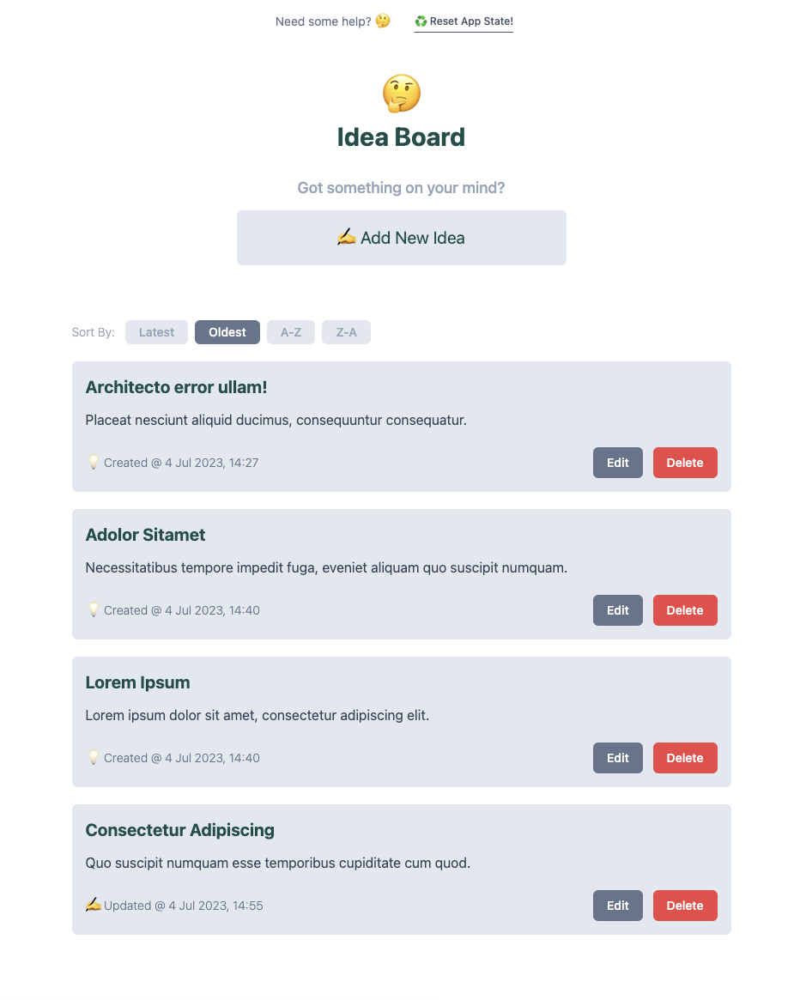

## The Task

Build an idea board that allows a user to create new ideas, edit existing ideas or delete them. Each idea should be represented as a tile on the board that displays a title, description and created/updated time. The title and description should be editable inline. The description text should have a max length of 140 characters. There should also be a button on the tile that allows for it to be deleted.

When working through the task you should treat it as if you're writing real world production code. We're looking to see a test suite, comments where required and an attention to detail. In addition to this you may use whatever libraries or packages you wish. This should take you around two or three hours to complete fully but feel free to spend as much or as little time on the exercise as you like. Detail anything you didn't get around to completing in the `COMMENTS.md` file along with any other additonal information we should be aware of when reviewing the code.

### Required

- Page should be fully responsive.
- Each idea tile should contain a title and description, which is editable, as well as created/updated time.
- New ideas should have the title field focused to prompt user to begin typing.
- Add the ability to sort ideas by creation date or alphabetically.

### Extra Points

- Utilise the localStorage API to persist current state when the page is refreshed.
- Add a character countdown as the user is approaching the limit of their description text.
- Add an unobtrusive notification when an update is made to a tile.

## Tech Choices

- Vite build engine
- Vitest for unit & integration testing
- Cypress for e2e testing
- React & Typescript for views 💪

## Important Commands

`npm run dev` will run the development server.
`npm run build` runs build script.
`npm run test:unit` will run the unit & integreation test suite.
`npm run test:unit:coverage` runs unit & integration test suite and generates a coverage report.
`npm run test:e2e` will run end to end test suite in headless mode. (Make sure your dev server is running first!)

## Application Preview

[🧑‍💻 Preview Live Application Here](https://kastaselis.github.io/idea-board/)

